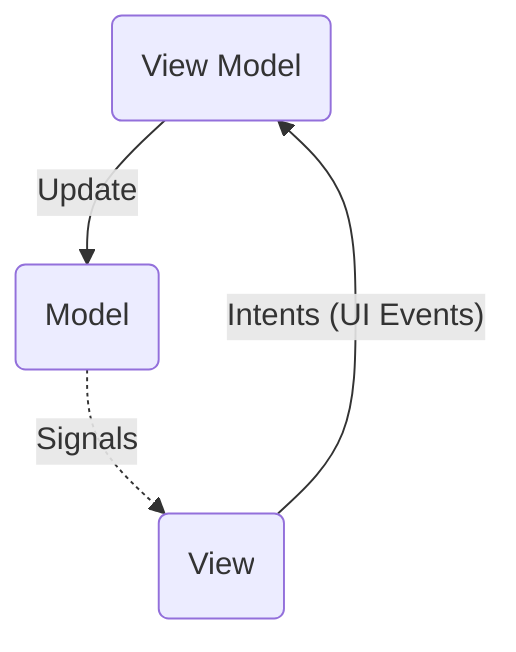
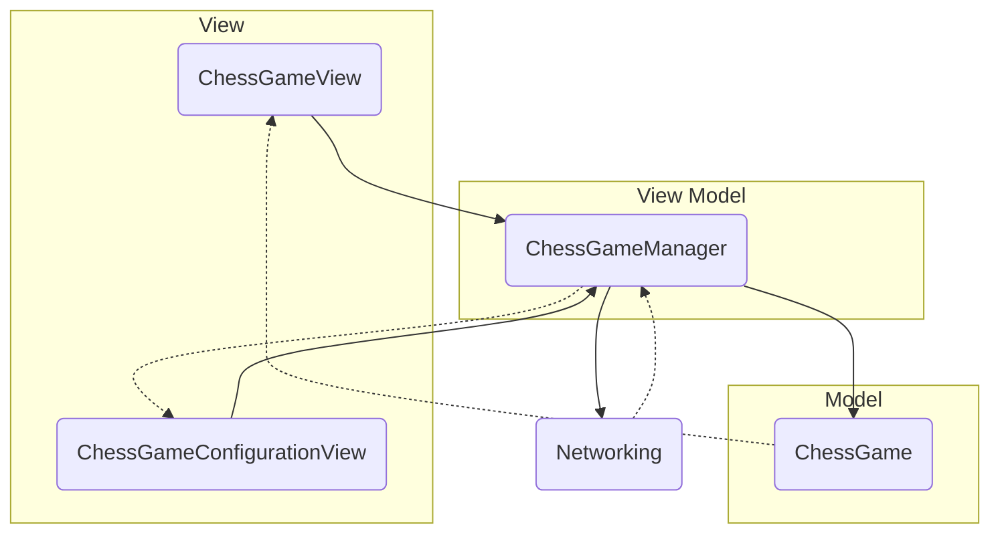

# README

本应用使用 Qt 5.15.2 开发。

## 架构

采用 MVC 架构的一种变形，如下图所示的 Model - View - View Model（MVVM）架构。



对于 MVC 架构，最重要的是保证数据在不同部分之间的流动是单向的，杜绝在同一个地方同时更新 Model 和 View。如上图所示，View 中点击等 UI 事件触发 Intent，由 View Model 进行网络请求等处理后，更新 Model，Model 在自身更新后发送 signals，View 根据信号进行更新。

本应用采取了以下方法严格实现数据的单向流动：

- 只有 View Model 持有 Model 对象
- View 只能通过 View Model 获取指向 Model 的 const 指针，因此不能改变 Model
- View Model 和 Model 不能访问 View 对象

由此，改变 Model 只能通过 View Model，而更新 View 只能通过 Model 发送的信号来间接实现，由此实现数据的单向流动。

具体而言，应用整体框架如下（其中部分 MVVM 省略了 Model 部分）：



## Model

Model 部分主要为负责游戏逻辑处理的 `ChessGame`。对 `ChessGame` 的职责设计和接口规定如下：

- 负责游戏状态的维护，私有

- 负责所有对游戏的输入：

  ```C++
  public:
      void start();	// 开始游戏
      void flipChess(const ChessPoint &pos);	// 翻棋
      void moveChess(const ChessPoint &source, const ChessPoint &dest);	// 移动棋子
      void surrender(bool isOpposite);	// 投降
  ```

- 负责所有游戏逻辑的判定：

  ```C++
  public:
      bool canAct() const;	// 可以输入操作
      bool canSurrender() const;	// 允许投降
      bool canMoveChess(const ChessPoint &source, const ChessPoint &dest) const;	// 判定棋子是否可以移动到某点
  ```

- 负责所有游戏状态更新后的信号发送：

  ```C++
  signals:
      void didUpdateChesses();	// 棋盘更新
      void chessDidFlip(const ChessPoint &pos);	// 翻棋
      void chessDidMove(const ChessPoint &source, const ChessPoint &dest);	// 移动
      void chessDidRemoved(const ChessPoint &point);	// 棋子消失
      void stateDidChange(State state, State oldState);	// 游戏状态改变
      void indexDidChange();	// 当前进行步数改变
      void remainingTimeDidChange(int seconds);	// 剩余时间改变
      void thisPlayerDidTimeout(int times);	// 本用户超时
      void anotherPlayerDidTimeout(int times);	// 对方超时
      void didStarted();	// 游戏开始
  ```

进行了界定后

由于涉及网络通信，两台机器上的状态同步需要格外注意。为了方便，对于游戏逻辑的判定均在**本地**进行，而根据对方发送的数据更新 Game 的方法详见后文。
