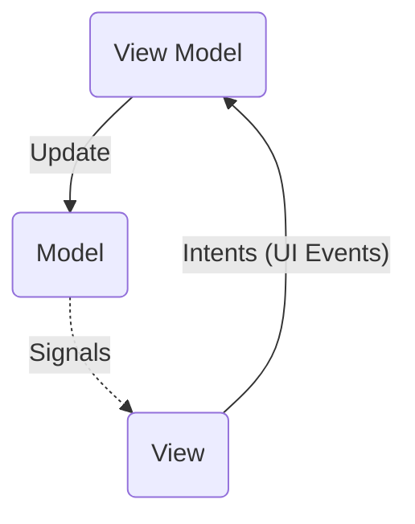
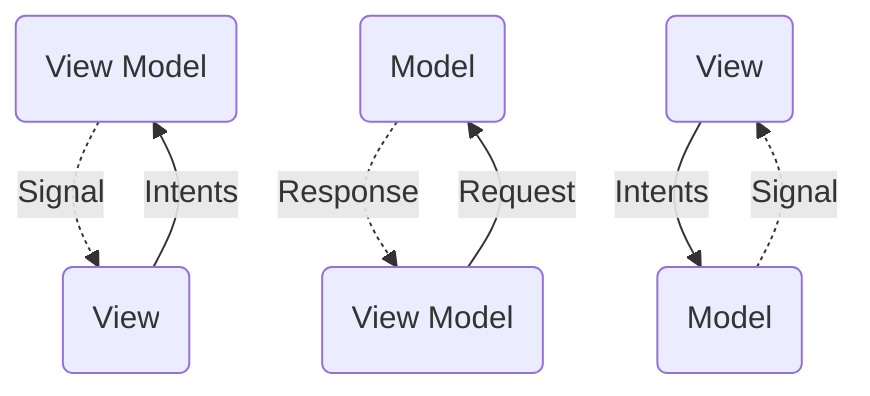
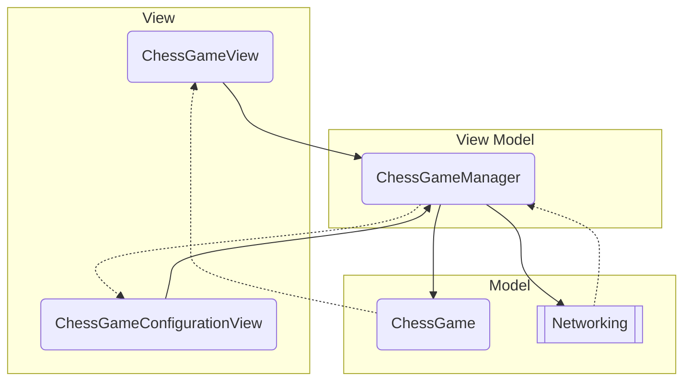
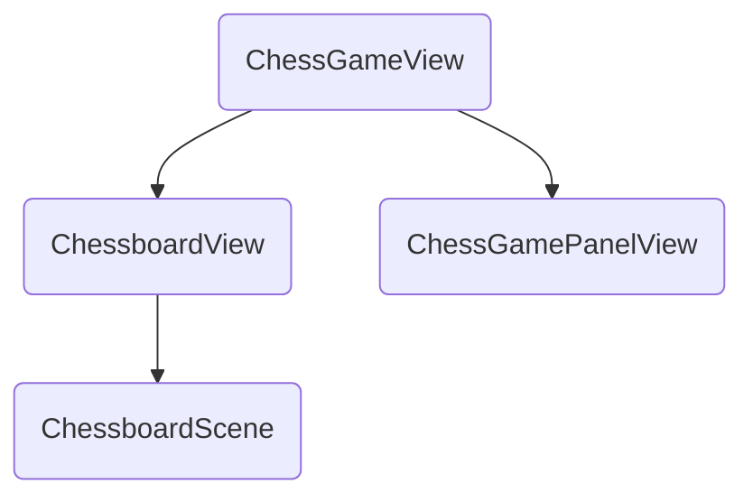

# README

本应用使用 Qt 5.15.2 开发。

## 架构

采用 MVC 架构的一种变形、如下图所示的 Model - View - View Model（MVVM）架构。



对于 MVC 架构，最重要的是保证数据在不同部分之间的流动是单向的，杜绝在同一个地方同时更新 Model 和 View。如上图所示，View 中点击等 UI 事件触发 intent，由 View Model 进行网络请求等处理后，更新 Model，Model 在自身更新后发送 signals，View 根据信号进行更新。

本应用采取了以下方法严格实现数据的单向流动：

- 只有 View Model 持有 Model 对象
- View 只能通过 View Model 获取指向 Model 的 const 指针，因此不能改变 Model
- View Model 和 Model 不能访问 View 对象

由此，改变 Model 只能通过 View Model，而更新 View 只能通过 Model 发送的信号来间接实现。借助 Qt 的 signal - slot 机制，我们很容易实现信息的流动。

当然，有时候为了简便，并不需要完整的 MVVM 结构，不过仍应满足单向数据流动：



具体而言，应用整体框架如下：



其中 View 包括游戏界面 `ChessGameView` 和连接界面 `ChessGameConfigurationView`，View Model 为 `ChessGameManager`，负责接受 View 传送的 actions、进行网络通信、更新 `ChessGame`，Model 为负责游戏逻辑的 `ChessGame` 和负责网络通信的一些类。

## 具体设计

### 游戏逻辑：`ChessGame`

#### 类设计

`ChessGame` 类负责游戏逻辑的处理。对 `ChessGame` 的职责设计和接口规定如下：

- 负责游戏状态的维护，私有

- 负责所有对游戏的输入，mutating：

  ```C++
  public:
      void start();	// 开始游戏
      void flipChess(const ChessPoint &pos);	// 翻棋
      void moveChess(const ChessPoint &source, const ChessPoint &dest);	// 移动棋子
      void surrender(bool isOpposite);	// 投降
  ```

- 负责所有游戏逻辑的判定，read only：

  ```C++
  public:
      bool canAct() const;	// 可以输入操作
      bool canSurrender() const;	// 允许投降
      bool canMoveChess(const ChessPoint &source, const ChessPoint &dest) const;	// 判定棋子是否可以移动到某点
  ```

- 负责所有游戏状态更新后的信号发送：

  ```C++
  signals:
      void didUpdateChesses();	// 棋盘更新
      void chessDidFlip(const ChessPoint &pos);	// 翻棋
      void chessDidMove(const ChessPoint &source, const ChessPoint &dest);	// 移动
      void chessDidRemoved(const ChessPoint &point);	// 棋子消失
      void stateDidChange(State state, State oldState);	// 游戏状态改变
      void indexDidChange();	// 当前进行步数改变
      void remainingTimeDidChange(int seconds);	// 剩余时间改变
      void thisPlayerDidTimeout(int times);	// 本用户超时
      void anotherPlayerDidTimeout(int times);	// 对方超时
      void didStarted();	// 游戏开始
  ```

#### 多用户同步

由于涉及网络通信，两台机器上的状态同步需要格外注意。为了方便，所有对于游戏逻辑的判定均在**本地**进行，不依赖对方程序上的结果。根据对方发送的数据更新 Game 的方法详见后文。

### 网络通信

#### 类设计

网络通信较为简单，分为 `ChessGameNetworkClient` 和 `ChessGameNetworkServer` 两个类。因 C/S 多数发送、解析数据的方式相同，在 C/S 类之下定义一个网络通信基类 `ChessGameNetworkBase`，实现：

- 发送 / 解析：
  - 游戏开始信号
  - 投降信号
  - 棋子翻转数据
  - 棋子移动数据
- 向调用者发送信号：
  - 已连接上
  - 已断开连接
  - 收到某个数据

Client 和 server 类在此基础上，添加了一些与连接、发送和接收棋盘数据有关的方法。

#### 通信协议

为方便，不对黏包情况作处理。

Header 规定如下：

- 4 字节的 `type`：数据类别，包括
  - `Flip = 200` 翻转棋子
  - `Move = 201` 移动棋子
  - `Chessboard = 202` 棋盘数据
  - `Surrender = 203` 投降
  - `Start = 204` 开始游戏
- 4 字节的 `index`：当前操作序号
  - 发送棋盘数据：`index = random_int(0, 20)`
  - 翻转棋子和移动棋子：`index = old_index + 1`
  - 其他：`index = any_int`；

其中 `index` 用于双方同步游戏。另外，`index` 的奇偶决定当前哪方可以进行棋子操作。初始化棋盘时，客户端生成一个范围在 `[0, 20]` 的随机数作为 `index` 的初始值，即可随机决定先后手。

Payload 的规定由各自需要传输的数据决定，只需要统一发送和解析的方法即可。

### 游戏界面

界面均采用纯代码编写，以方便维护。

游戏界面关系如下：



`ChessGameView` 包括显示状态信息、操作按钮的 `ChessGamePanelView`，和绘制棋盘的 `ChessboardView`。`ChessboardView` 使用 `ChessboardScene` 进行绘制。

#### 棋盘绘制

棋盘的绘制使用 Qt 的 Graphics View 框架，其子组件可独立管理，正好契合我们的要求。

#### 事件响应
